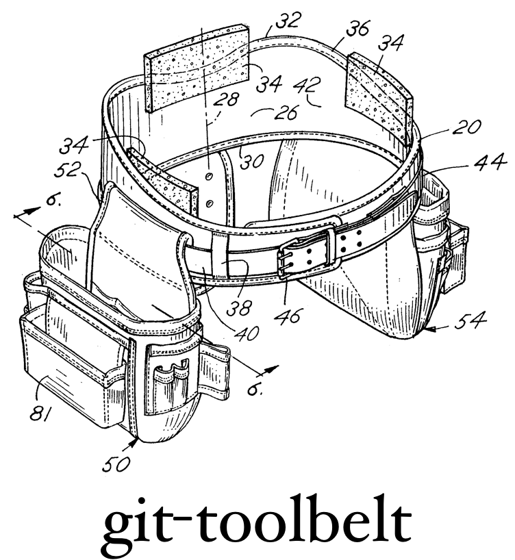

<div align="center">
  <br>
</div>

# Installation instructions

    $ brew install moreutils
    $ brew install nvie/tap/git-toolbelt

# git-tools

Helper tools to make everyday life with Git much easier.  Commands marked with
⭐️ are my personal favorites and are commands I use almost every day.

Everyday helpful commands:

* ⭐️ [git-cleanup](#git-cleanup)
* [git-current-branch](#git-current-branch)
* ⭐️ [git-fixup](#git-fixup)
* ⭐️ [git-active-branches](#git-active-branches)
* [git-local-branches](#git-local-branches)
* [git-local-commits](#git-local-commits)
* [git-merged / git-unmerged / git-merge-status](#git-merged--git-unmerged--git-merge-status)
* [git-recent-branches](#git-recent-branches)
* [git-remote-branches](#git-remote-branches)
* [git-repo](#git-repo)
* [git-root](#git-root)
* [git-initial-commit](#git-initial-commit)
* ⭐️ [git-sha](#git-sha)
* [git-stage-all](#git-stage-all)
* [git-unstage-all](#git-unstage-all)
* [git-update-all](#git-update-all)
* [git-workon](#git-workon)
* ⭐️ [git-modified](#git-modified)

Statistics:

* [git-committer-info](#git-committer-info)

Commands to help novices out:

* [git-drop-local-changes](#git-drop-local-changes)
* [git-stash-everything](#git-stash-everything)
* ⭐️ [git-push-current](#git-push-current)
* [git-undo-commit](#git-undo-commit)
* [git-undo-merge](#git-undo-merge)

Commands that simplify scripting. These commands typically only return exit
codes and have no output.

* [git-is-repo](#git-is-repo)
* [git-is-headless](#git-is-headless)
* [git-has-local-changes / git-is-clean / git-is-dirty](#git-has-local-changes--git-is-clean--git-is-dirty)
* [git-has-local-commits](#git-has-local-commits)
* [git-contains / git is-ancestor](#git-contains--git-is-ancestor)
* [git-local-branch-exists](#git-local-branch-exists)
* [git-remote-branch-exists](#git-remote-branch-exists)
* [git-tag-exists](#git-tag-exists)

Advanced usage:

* [git-assume / git-unassume / git-show-assumed](#git-assume--git-unassume--git-show-assumed)
* [git-commit-to](#git-commit-to)
* [git-cherry-pick-to](#git-cherry-pick-to)
* ⭐️ [git-delouse](#git-delouse)


### git current-branch

Returns the name of the current branch, if any.  Why doesn't this come with git?

```console
$ git current-branch
master
```

Alias to `git rev-parse --abbrev-ref HEAD`.


### git sha

Returns the SHA value for the specified object, or the current branch head, if
nothing is provided.

```console
$ git sha <some-object>
```

Typical example:

```console
$ git sha HEAD
f688d7543c5d52f5f78b3db1b0dd1616059299a4
$ git sha -s HEAD
f688d75
```

Shows the commit SHA for the latest commit.


### git modified

Returns a list of locally modified files.  In contrast to git status, it does
not include any detailed file status, and never includes non-existing files.

This makes it ideal for the following use-case:

```console
$ vim (git modified)
```

If you want to locally modified files that are already staged, too, use:

```console
$ vim (git modified -i)
```


### git push-current

Pushed the current branch out to `origin`, and makes sure to setup tracking of
the remote branch.  Shorthand for `git push -u origin <current-branch>`.

Accepts options, too, so you can use

```console
$ git push-current -f
```

to force-push.


### git is-headless

Tests if `HEAD` is pointing to a branch head, or is detached.


### git local-branches / git remote-branches / git active-branches

Returns a list of local or remote branches, but contrary to Git's default
commands for this, returns them machine-processable.  In the case of remote
branches, can be asked to return only the branches in a specific remote.

A branch is deemed "active" if its head points to a commit authored in the last
3 weeks.


### git local-branch-exists / git remote-branch-exists / git tag-exists

Tests if the given local branch, remote branch, or tag exists.


### git recent-branches

Returns a list of local branches, ordered by recency:

    $ git recent-branches
    foo
    master
    bar
    qux


### git local-commits / git has-local-commits

Returns a list of commits that are still in your local repo, but haven't been
pushed to `origin`.  `git has-local-commits` is the scriptable equivalent that
only returns an exit code if such commits exist.


### git contains / git is-ancestor

Tests if X is merged into Y:

    $ git contains X Y  # does X contain Y?
    $ git is-ancestor X Y  # is X an ancestor of Y?

**CAVEAT:**  
Even though they might look like opposites, `X contains Y` does not mean `not
(X is-ancestor Y)`, since (1) X and Y can point to the same commit, or the
branches may have no common history and thus be unrelated completely.


### git stage-all

Mimics the index / staging area to match the working tree exactly.  Adds files,
removes files, etc.

Alias to `git add --all`.


### git unstage-all

Unstages everything.  Leaves the working tree intact.

Alias to `git reset HEAD`.


### git undo-merge

Ever created a merge accidentally, or decided that you didn't want to merge
after all?  You can undo the last merge using `git undo-merge`.


### git undo-commit

Ever committed too soon, or by accident?  Or on the wrong branch?  You can now
undo your last commit and you won't lose any data.  All the changes in the
commit will be staged (like right before the commit) and the commit itself is
gone.


### git cleanup

Deletes all branches that have already been merged into master or develop.
Keeps other branches lying around.  Removes branches both locally and in the
origin remote.  Will be most conservative with deletions.


### git fixup

Amend all local staged changes into the last commit. Ideal for fixing typo's,
when you don't want to re-edit the commit message.

    $ git commit -m "Something cool."
    $ vim somefile.txt  # fix typo
    $ git add somefile.txt
    $ git fixup  # merge this little change back into the last commit


### git workon

Convenience command for quickly switching to a branch <name>. If such local
branch does not exist, but there is a remote branch named origin/<name>, then
a local branch is created and the remote is tracked. If the local branch
already exists, it's git pull --rebase'ed to update to the latest remote state.


### git delouse

Say you want to rebuild your last commit, but want to keep the commit message.
git delouse empties the last commit on the current branch and places all
changes back into the working tree.

Since the commit remains in history, you can now rebuild the commit by "git
amend"'ing or "git fixup"'ing, instead of making new commits.


### git commit-to

Ever been on a branch and really wanted to quickly commit a change to
a different branch?  Given that this is possible without merge conflicts, git
commit-to will allow you to do so, without checking out the branch necessarily.

    $ git branch 
      master
    * mybranch
    $ git status
    M foo.txt
    M bar.txt
    $ git add foo.txt
    $ git commit-to master -m "Add foo to master."
    $ git add bar.txt
    $ git commit -m "Add bar to mybranch."


### git cherry-pick-to

Every been on a branch, just made a commit, but really want that commit
available on other branches as well? You can now cherry-pick this commit to any
branch, staying on the current branch. (Given the change won't lead to a merge
conflict.)

    $ git branch
      master
    * mybranch
    $ git add foo.txt
    $ git commit -m "Really useful thing."
    $ git cherry-pick-to master HEAD
    $ git branch  # did not switch branches
      master
    * mybranch


### git is-repo

Helper function that determines whether the current directory has a Git repo
associated to it.  Scriptable equivalent of `git repo`.


### git root / git repo

`git root` prints the root location of the working tree.

    $ cd /path/to/worktree
    $ cd some/dir/in/worktree
    $ pwd
    /path/to/worktree/some/project/dir
    $ git root
    /path/to/worktree

`git repo` prints the location of the Git directory, typically `.git`, but
could differ based on your setup.  Will return with a non-zero exit code if not
in a repo.

    $ cd /path/to/my/worktree
    $ git repo
    .git
    $ cd /tmp
    $ git repo
    fatal: Not a git repository (or any of the parent directories): .git


### git initial-commit

`git initial-commit` prints the initial commit for the repo.

    $ git initial-commit
    48c94a6a29e9e52ab63ce0fab578101ddc56a04f


### git has-local-changes / git is-clean / git is-dirty

Helper function that determines whether there are local changes in the working
tree, by returning a 0 (local changes) or 1 (no local changes) exit code.


### git drop-local-changes

Don't care about your local working copy's state and really want to revert back
to whatever is recorded in the history? git drop-local-changes lets you do
this.

This covers aborting rebases, undoing partial merges, resetting the index and
removing any unknown local files from the work tree. Anything that is already
committed remains safe.

??? issue a git pull, too? Typical beginners will want this.


### git stash-everything

The stash behaviour you (probably) always wanted.  This actually stashes
everything what's in your index, in your working tree, and even stashes away
your untracked files, leaving a totally clean working tree.

Using "git stash pop" will recover all changes, including index state, locally
modified files, and untracked files.


### git update-all

Updates all local branch heads to the remote's equivalent.  This is the same as
checking out all local branches one-by-one and pulling the latest upstream
changes.  Will only update if a pull succeeds cleanly (i.e. is a fast-forward
pull).


### git-merged / git-unmerged / git-merge-status

This trio of subcommands makes it easy to inspect merge status of local
branches.  Use them to check whether any local branches have or haven't been
merged into the target branch (defaults to master).

git-merge-status is a useful command that presents both lists in a single
overview (not for machine processing).


### git-committer-info

Shows contribution stats for the given committer, like "most productive day",
"most productive hour", "average commit size", etc.


### TODO: git force-checkout

Don't care about your local working copy's state and really want to switch to
another branch? git force-checkout lets you do this.

Switching branches can be prevented by git. For good reasons, mostly. Git is
designed to prevent you from losing data potentially. Examples are there are
local unmerged files, or some files that would be overwritten by doing the
checkout.

By using force-checkout you basically give git the finger, and check out
a branch anyway. **You do agree to lose data when using this command.**

    $ git checkout master
    error: Your local changes to the following files would be overwritten by checkout:
        foo/bar.txt
    Please, commit your changes or stash them before you can switch branches.
    Aborting
    $ git force-checkout master
    Switched to branch 'master'


### git conflicts

Generates a summary for all local branches that will merge uncleanly—i.e. will
lead to merge conflicts later on.

    $ git branch
      develop
    * mybranch
      master
      other-branch
    $ git conflicts
    develop... merges cleanly
    master...  merges cleanly
    other-branch... CONFLICTS AHEAD


### git-assume / git-unassume / git-show-assumed

Git supports marking files "assumed unchanged", meaning any change in the file
locally will not be shown in status reports, or be added when you stage all
files.  This feature can be useful to toggle some switches locally, or
experiment with different settings, without running the risk of accidentally
committing this local data (that should remain untouched in the repo).

Notice that status reports won't show these files anymore, so it's also easily
to lose track of these marked assumptions, and you probably run into weird
issues if you don't remember this. (This is the reason why I put these scripts
in the "advanced" category.)

Basic usage:

    $ git status
     M foo.txt
     M bar.txt
     M qux.txt
    $ git assume foo.txt
    $ git status
     M bar.txt
     M qux.txt
    $ git show-assumed
    foo.txt
    $ git commit -am 'Commit everything.'
    $ git status
    nothing to commit, working directory clean
    $ git is-clean && echo "clean" || echo "not clean"
    not clean
    $ git unassume -a
    $ git status
     M foo.txt

As you can see, `git-is-clean` is aware of any lurking "assumed unchanged"
files, and won't report a clean working tree, as these assumed unchanged files
often block the ability to check out different branches.
